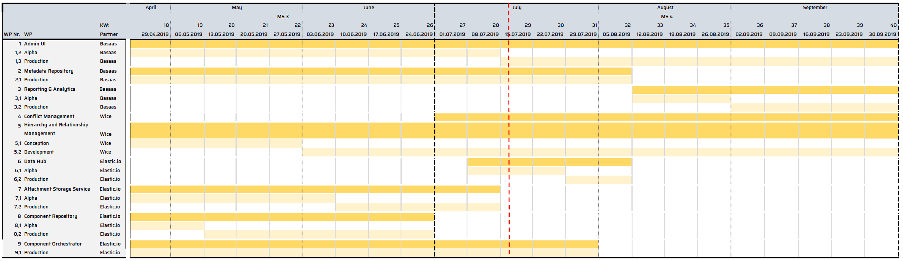

---

**Creator:** Philipp ([@philecs](github.com/philecs)), Cloud Ecosystem e.V.  
**Last Modified:** 06-05-2019  
**Last Modifier:** Philipp ([@philecs](github.com/philecs)), Cloud Ecosystem e.V.  
**Version:** -   

---

# Microservice Overview

|Microservice Name|Responsibility|Status|Link to documentation|
|---|---|---|---|
|Attachement-Storage-Service|[Elastic.io GmbH](https://www.elastic.io/)||See: [Attachments Storage Service](services/attachment-storage-service)|
|Audit Log|[Wice GmbH](https://wice.de/)||See: [Audit Log](services/audit-log/README.md), [Audit Log Requirements](docs/services/AuditLog/AuditLogRequirements.md) and [Message Format](services/AuditLog/MessageFormat.md)|
|Component Orchestrator|[Elastic.io GmbH](https://www.elastic.io/)| |See: [Component Orchestrator](services/component-orchestrator/README.md)|
|Component Repository|[Elastic.io GmbH](https://www.elastic.io/)| |See: [ComponentRepository](/services/component-repository/README.md)|
|Conflict-Management|[Wice GmbH](https://wice.de/)||See: [Conflict Management Concepts](docs/conflictManagement)|
|Data Hub|[Elastic.io GmbH](https://www.elastic.io/)||-|
|Flow Repository|[Wice GmbH](https://wice.de/)||See: [Flow Repository](services/flow-repository/README.md)|
|Hierarchy and Relationship Management|[Wice GmbH](https://wice.de/)| |-|
|IAM|[Basaas GmbH](https://www.basaas.com/)||See: [IAM](services/iam/README.md), [Concepts](docs/services/IAM/IAMConcept.md)|
|Logging & Monitoring|[Elastic.io GmbH](https://www.elastic.io/)||See: [Logging and Monitoring](services/LoggingMonitoring.md)|
|Message oriented Middleware|[Elastic.io GmbH](https://www.elastic.io/)||See: [MessageOrientedMiddleware](/docs/services/MessageOrientedMiddleware.md)|
|Metadata Repository|[Basaas GmbH](https://www.basaas.com/)| |See: [Meta-Data-Repository](services/meta-data-repository/README.md)|
|Reporting and Analytics APIs|[Basaas GmbH](https://www.basaas.com/)||-|
|Scheduler|[Elastic.io GmbH](https://www.elastic.io/)||See: [Scheduler](services/scheduler/README.md), [Scheduler Concept](docs/services/Scheduler.md)|
|Secret-Service|[Basaas GmbH](https://www.basaas.com/)||See: [Secret-Service](services/secret-service/README.md), [Concepts](docs/services/SecureKeyManagementConcept.md)|
|Webhooks|[Elastic.io GmbH](https://www.elastic.io/)||See: [Webhooks](services/webhooks/README.md)|

# Roadmap

