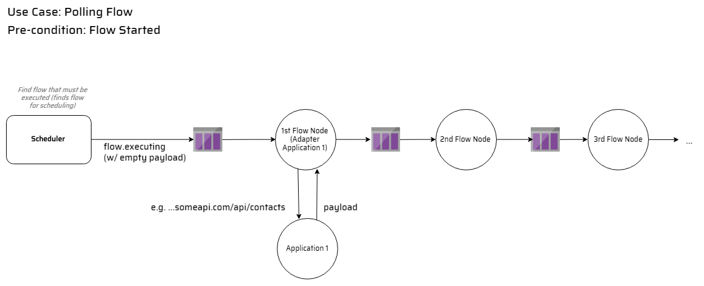
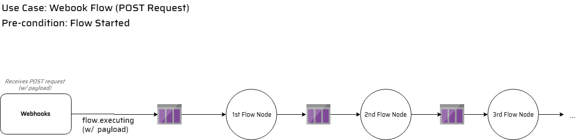
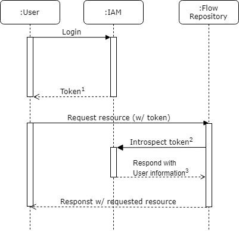

---

**Creator:** Philipp ([philecs](https://github.com/philecs)), Cloud Ecosystem e.V. <br>
**Last revised by:** - <br>
**Last update:** 15-03-2019

---

# Introduction

This document is designed to describe different service collaboration examples. It should act as a starting point to easily understanding the architecture of the Open Integration Hub.
Most of the examples are triggered by user interactions (e.g. starting a flow) and only the "happy path" i.e. success scenario is described.

Each example is described through a graphical overview, a textual description and pre-conditions.
For further information for a specific version please have a look at the [services](../../../services) itself.

- [Introduction](#introduction)
  - [Starting a flow](#starting-a-flow)
    - [Detailed Service Consideration](#detailed-service-consideration)
      - [Flow repository](#flow-repository)
      - [Webhooks](#webhooks)
      - [Scheduler](#scheduler)
  - [Execute Polling Flow](#execute-polling-flow)
  - [Execute Webhook Flow](#execute-webhook-flow)
    - [POST Request](#post-request)
    - [GET Request](#get-request)
  - [Request Resources](#request-resources)
  - [Creating audit log records](#creating-audit-log-records)

## Starting a flow

**Pre-Conditions:** None.

This example describes the scenario of starting a flow. Once the user starts a flow the following steps are processed:

1. Client starts a flow using flow repository's REST API.
2. `Flow Repository` sets the flow's `status` to `starting` and raises the event `flow.starting`.
3. There are 3 services listening to the event `flow.starting`:  Webhooks, Scheduler and Component Orchestrator. `Webhooks` and `Scheduler` examine the event's payload and decide if they need to react appropriately. We will discuss the exact reaction of both services later in this document.
4. Upon receiving `flow.starting` event the `Component Orchestrator` starts deploying the containers. Once all containers were deployed, `Component Orchestrator` raises the `flow.started` event.
5. `Flow Repository` receives the `flow.started` event and switches flow's `status` property from `starting` to `started`.
6. `Webhooks` receives the `flow.started` event and starts receiving incoming HTTP calls for the given flow.
7. `Scheduler` receives the `flow.started` event and starts scheduling the flow, according to it's cron property.
8. When a client stops a running flow using flow repository's REST API, the event `flow.stopping` is raised which is causing an inverse reaction chain of events.


Figure: _startFlow_

### Detailed Service Consideration

Now let's discuss the individual services in details.

#### Flow repository

- `POST /flows/{id}/start`: Used to start a flow
- `POST /flows/{id}/stop`: Used to stop a flow

Upon receiving the HTTP call for starting a flow, Flow Repository sets the flows `status` to starting. Upon receiving stopping request it sets the status to `stopping`. If the flow has been started and flow repsitory receives `flow.started` event it sets the status to `active` while it sets it to `inactive` upon receiving `flow.stopped`. The schema of the event payload is shown below.

```yaml
Event:
  type: object
  required:
    - headers
    - payload
  properties:
    headers:
      type: object
       required:
         - name
         - createdAt
         - serviceName
      properties:
        name:
          type: string
        createdAt:
          type: string
          format: date-time
        serviceName:
          type: string
    payload:
      type: object
```

The `payload` property is an arbitrary object to be sent with the event. Flow repository will send the entire flow as `payload`.

#### Webhooks

Upon receiving `flow.starting` event the service checks if the `cron` property is **not** set. If so, the service persist a data record in his local DB but **doesn't start receiving HTTP requests** for the given flow yet. The following table demonstrates an example of such records.

| flowId        | queue           | 
| ------------- |:-------------:|
| 58b41f5da9ee9d0018194bf3      | queue_58b41f5da9ee9d0018194bf3 | 
| 5b62c91afd98ea00112d5404      | queue_5b62c91afd98ea00112d5404      | 

After receiving the `flow.started` event, the service starts accepting incoming messages from the flow's webhook URL and sends them to the corresponding queues to be handled by flow nodes. This is actually how it is accomplished today. The only difference is that webhooks service is retrieving all the required data about a webhook flow from its local DB.

Please note that the webhooks service ignores the event if the following condition is met:

- `cron` property is set in the event

Upon receiving the `flow.stopping` event, the service deletes the record for the given flow and stops accepting requests.

#### Scheduler

Upon receiving `flow.starting` event the service checks if the `cron` property is set. If so, the service persist a data record in his local DB, but **doesn't start scheduling** the given flow yet. The following table demonstrates an example of such records.

| flowId        | cron           |  dueExecution |
| ------------- |:-------------:|:-------------:|
| 58b41f5da9ee9d0018194bf3      | */3 * * * * | 2019-01-25T13:39:28.172 |
| 5b62c91afd98ea00112d5404      | 15 14 * * 1-5      |  2019-01-27T14:15:00.00 |

Upon receiving the `flow.started` event the service starts scheduling the flow executions by retrieving the flow data from its local DB.

Please note that the scheduler service ignores the event if the following condition is met:

- `cron` property is **not** set in the event

Upon receiving the `flow.stopping` event, the service deletes the record for the given flow and stops scheduling flow executions.

## Execute Polling Flow

**Pre-Conditions:** Starting a flow.

As described in [scheduler section](#scheduler) when a flow is started the service starts scheduling the flow executions. Once the scheduler finds a flow that is ready for execution it pushed a message including the relating flow ID to the queue. The recipient is the first node of the flow which is the application specific adapter. This adapter then makes a GET request to the aplications API to get the payload. Afterwards it pushes the message including the payload onto the queue.

The message format of the messages emitted by scheduler have the following structure:

```js

{
    "id" : //some record uuid,
    "attachments":{
        //empty
    },
    "body": {
        //empty
    },
    "headers": {
        //empty
    },
    "metadata": {
        //empty
    }
}
```



Figure: _executePollingFlow_

## Execute Webhook Flow

### POST Request

**Pre-Conditions:** Starting a flow.

Once Webhooks receives a POST request it pushes the message to the queue. The recipient is the first node of the flow which is the application specific adapter.
In contrast to the GET request, this request already includes the payload.

The following example shows the message format of Webhooks messages:

```js
{
  "headers": {
    //GET request headers
  },
  "query": {
    //POST request query parameters
  },
  "body": {
    //POST request body
  },
  //other properties
}
```



Figure: _executeWebhookFlowPost_

### GET Request

**Pre-Conditions:** Starting a flow.

Once Webhooks receives a GET request it takes the url parameters and request headers and put it into the message. This means in particular the headers go to `headers` while query string parameters go to `body`. It then pushes the message to the queue. The recipient is the first node of the flow which is the application specific adapter. This adapter then makes a GET request to the aplications API to get the payload. Afterwards it pushes the message including the payload onto the queue.

The following example shows the message format of Webhooks messages:

```js
{
  "headers": {
    //GET request headers
  },
  "body": {
    //GET request query string parameters
  },
  //other properties
}
```

An examplary webhook GET request could look like the following: `GET /hook/<flow-id>?param1=value&param2=value`


Figure: _executeWebhookFlowGet_

## Request Resources

The following example shows how a user can request a resource using IAM. The graphic below shows how this example would look like if a user request a resource from the flow repository.

1. User logs in into IAM.
2. IAM responds with an ephemeral token.
3. User uses the ephemeral token to request a cetrain resource (e.g. a specific flow by id).
4. Flow repository introspects the ephemeral token at IAM (services accounts receive a permanent token when they first register) using IAM utils (middleware).
5. IAM responds with user information such as username, tenant, tenant specific role and user permissions related to this token.
6. Flow Repsitory checks if the user has the permission to request the resource.
7. Flow repository responds with the requested information.

Illustration of this process:  (Figur _requestResourceSuccess_).



Figure: _requestResourceSuccess_

**1**: Ephemeral token<br>
**2**: Service makes request with service account token<br>
**3**: User information e.g.: username, tenant, tenant specific role, permissions

## Creating audit log records

To create a record that should be stored in the audit log a service simply has to put a message onto the queue with a predefined topic. Each service decides on its own, which events should be stored in the audit log service.
Audit log listens to all events having `audit.*` as topic.


