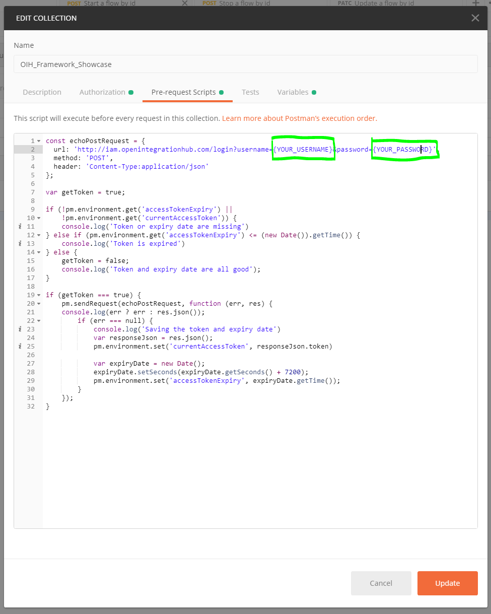
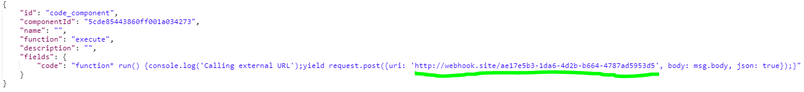
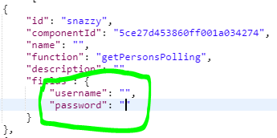

# Introduction

This document is designed as a guide on _how to propely use the open integration hub with postman_.

- [Introduction](#introduction)
  - [Prerequisites](#prerequisites)
  - [SetUp](#setup)
  - [Use Cases](#use-cases)
    - [Flows](#flows)
      - [Get All Flows](#get-all-flows)
      - [Get a Flow](#get-a-flow)
      - [Post a Flow](#post-a-flow)
      - [Update a Flow](#update-a-flow)
      - [Delete a Flow](#delete-a-flow)
      - [Start a Flow](#start-a-flow)
      - [Stop a Flow](#stop-a-flow)
    - [Components](#components)
      - [Get All Components](#get-all-components)
      - [Get a Component](#get-a-component)
      - [Post a Component](#post-a-component)
      - [Update a Component](#update-a-component)
      - [Delete a Component](#delete-a-component)
    - [Identity and Access Management](#identity-and-access-management)
      - [Login](#login)
  - [Examples](#examples)
    - [Flow Examples](#flow-examples)
    - [Component Examples](#component-examples)

## Prerequisites

In order to use the Open Integration Hub we provided a [postman collection](postman/OIH_Framework_Showcase.postman_collection.json) and a [postman environment](OIH_Framework.postman_environment.json).

We suggest to download and import these files to easily process the steps described in the following.

## SetUp

Before you start using the framework you need a user account (username & passoword). Please request a new account from [@philecs](https://github.com/philecs). E-Mail: <philipp.hoegner@cloudecosystem.org>.

It is necessary to add valid user data in order to perform the requests.
Please process the following steps in order to be able to generate a valid token for the requests:

1. Right click on the `OIH_SHOWCASE_COLLECTION` and click on `edit` OR click on the three dots `...` and click `edit`.
2. Jump to `Pre-request Scripts`
3. Replace `{YOUR_USERNAME}` with the username you received
4. Replace `{YOUR_PASSWORD}` with the password you received
5. Click on `Update`

Here you can see where you should add the username and password:


Now you can proceed and use the predefined requests.

## Use Cases

### Flows

For further information on the underlying flow repository please visit the [API docs](http://flow-repository.openintegrationhub.com/api-docs/) and [GitHub](https://github.com/openintegrationhub/openintegrationhub/tree/master/services/flow-repository).

#### Get All Flows

**Type of request:** GET

**Postman request name:** Get user flows

Steps to perform:

1. Click on `Send`

---

#### Get a Flow

**Type of request:** GET

**Postman request name:** Get flow by id

Steps to perform:

1. Replace the `{FLOW_ID}` placeholder with an existing flow id
2. Click on `Send`

---

#### Post a Flow

**Type of request:** POST

**Postman request name:** Post a new flow

1. Go to the `Body` tab
2. Add a new flow (exemplary flows can be found at the end of this document)
3. Click on `Send`

_Note:_ The property `componentId` must point to an existing component within the component repository (See: [components](#components))

_Hint:_ There is a predefined body that can be used.

---

#### Update a Flow

**Type of request:** PATCH

**Postman request name:** Update a flow by id

1. Go to the `Body` tab
2. Add a the updated (exemplary flows can be found at the end of this document)
3. Click on `Send`

_Note:_ Partial updates to a flow are possible. If you want to change a property of a flow graph you must provide the whole `flow.graph` property.

_Hint:_ There is a predefined body that can be used.

---

#### Delete a Flow

**Type of request:** DELETE

**Postman request name:** Delete a flow by id

1. Replace the `{FLOW_ID}` placeholder with an existing flow id
2. Click on `Send`

---

#### Start a Flow

**Type of request:** POST

**Postman request name:** Start a flow by id

1. Replace the `{FLOW_ID}` placeholder with an existing flow id
2. Click on `Send`

---

#### Stop a Flow

**Type of request:** POST

**Postman request name:** Stop a flow by id

1. Replace the `{FLOW_ID}` placeholder with an existing flow id
2. Click on `Send`

---

### Components

#### Get All Components

**Type of request:** GET

**Postman request name:** Get user components

Steps to perform:

1. Click on `Send`

---

#### Get a Component

**Type of request:** GET

**Postman request name:** Get a component by id

Steps to perform:

1. Replace the `{COMPONENT_ID}` placeholder with an existing component id
2. Click on `Send`

---

#### Post a Component

**Type of request:** POST

**Postman request name:** Post a new component

1. Go to the `Body` tab
2. Add a new flow (exemplary components can be found at the end of this document)
3. Click on `Send`

_Note:_ The image must have a valid _tag_. E.g. openintegrationhub/ms-office-adapter:latest

_Hint:_ There is a predefined body that can be used.

---

#### Update a Component

**Type of request:** PATCH

**Postman request name:** Update a component by id

1. Replace the `{COMPONENT_ID}` placeholder with an existing component id
2. Go to the `Body` tab
3. Add a the updated (exemplary components can be found at the end of this document)
4. Click on `Send`

_Hint:_ There is a predefined body that can be used.

---

#### Delete a Component

**Type of request:** DELETE

**Postman request name:** Delete a component by id

1. Replace the `{COMPONENT_ID}` placeholder with an existing component id
2. Click on `Send`

---

### Identity and Access Management

#### Login

**Type of request:** Post

**Postman request name:** Login

1. Go to the `Params` tab
2. Enter your username as the value for key:`username`
3. Enter your password as the value for key:`password`
4. Click on send

_Note_: As described in the [setup](#setup) section, there is no need to login manually as the pre-request script takes care of receiving and renewing the token.

---

## Examples

### Flow Examples

This example synchronizes contact data from SnazzyContacts to Wice and to Webhook.Site.

In order to display your data correctly it is necessary that you perform the subsequent steps before you post the flow.

1. Go to webhook.site
2. Copy the link to the clipboard
3. Exchange the predefined uri in the Code-Component with the one you copied to your clipboard
4. Add username and password for the node with id `snazzy`
5. Add username, password and client_name for the node with id `wice_adapter`

_Note:_ If you don't have a test account for one (SnazzyContacts/WiceCRM) or both applications please request one from [hschmidthh](https://github.com/hschmidthh) EMail:<hschmidt@wice.de>

Step3:


Step4:



Step5:


Flow:

```json
{
   "name":"SnazzyToWiceAndCodeComponent",
   "description":"This flow polls for persons and pushed them to webhook.site and wice crm.",
   "graph":{
      "nodes":[
         {
            "id":"snazzy",
            "componentId":"5ce27d453860ff001a034274",
            "name":"",
            "function":"getPersonsPolling",
            "description":"",
            "fields":{
               "username":"",
               "password":""
            }
         },
         {
            "id":"snazzy_transformer",
            "componentId":"5ce27f4b3860ff001a034277",
            "name":"",
            "function":"transformPersonToOih",
            "description":""
         },
         {
            "id":"wice_transformer",
            "componentId":"5ce27f2d3860ff001a034276",
            "name":"",
            "function":"transformPersonFromOih",
            "description":""
         },
         {
            "id":"wice_adapter",
            "componentId":"5ce27d653860ff001a034275",
            "name":"",
            "function":"upsertPerson",
            "description":"",
            "fields":{
               "username":"",
               "password":"",
               "client_name":""
            }
         },
         {
            "id":"code_component",
            "componentId":"5cde85443860ff001a034273",
            "name":"",
            "function":"execute",
            "description":"",
            "fields":{
               "code":"function* run() {console.log('Calling external URL');yield request.post({uri: 'http://webhook.site/ae17e5b3-1da6-4d2b-b664-4787ad5953d5', body: msg.body, json: true});}"
            }
         }
      ],
      "edges":[
         {
            "source":"snazzy",
            "target":"snazzy_transformer"
         },
         {
            "source":"snazzy_transformer",
            "target":"wice_transformer"
         },
         {
            "source":"wice_transformer",
            "target":"code_component"
         },
         {
            "source":"wice_transformer",
            "target":"wice_adapter"
         }
      ]
   },
   "type":"ordinary",
   "cron":"*/3 * * * *",
   "owners":[

   ]
}
```

### Component Examples