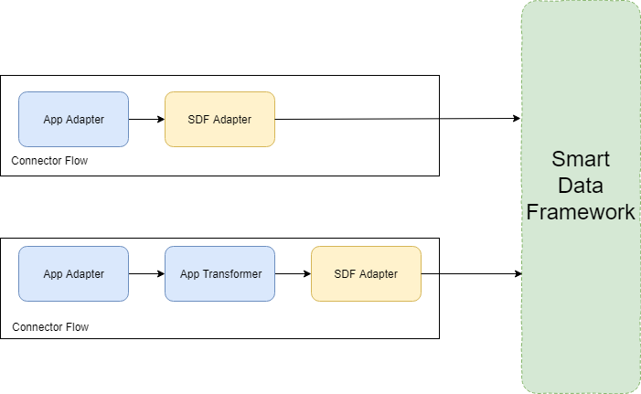

# Introduction

The Smart Data Framework Adapter (SDF-Adapter) allows flows to communicate with the smart data framework. It is responsible for forwarding the incoming events to the smart data framework. Furthermore, it is responsbile for increasing the ease of use for connector developers as it masks service endpoints.

## Entrypoint

The SDF-Adpater is triggered by incoming events received from either the preceding adapter or the transformer (depending on oih operator configuration).

## Message Processing

If a message arrives from the preceding component it is forwared to the correct service(s)/queue(s). One possible recipient of the forwarded message is the [dispatcher component](component-dispatcher.md).



If scenario 1 is realized it is necessary that the sdf adapter provides meta information in order to clearly identify the data set after it has been pushed onto the queue.

The following snippet shows an example of a dataset that has been processed by the sdf adapter:

```json
{
    "data":{
        "firstName": "Philipp",
        "lastName": "Hoegner"
    },
    "meta":{
        "domain": "addresses",
        "resource": "person",
        "transformerID": "XYZ",
        "source": {}
    }
}
```

## Open Questions

- Format: Will the sdf adpater be realized as a generic adapter component / library / etc. ?
- Which recipients exist (E.g. dispatcher, validator, datahub, etc.) ?
- Which possible input must be handled by the sdf adapter (JSON Objects, binary files, etc.) ?
  - How to process the different types of input data?
- Which information are (further) needed in order to identify the data record?
