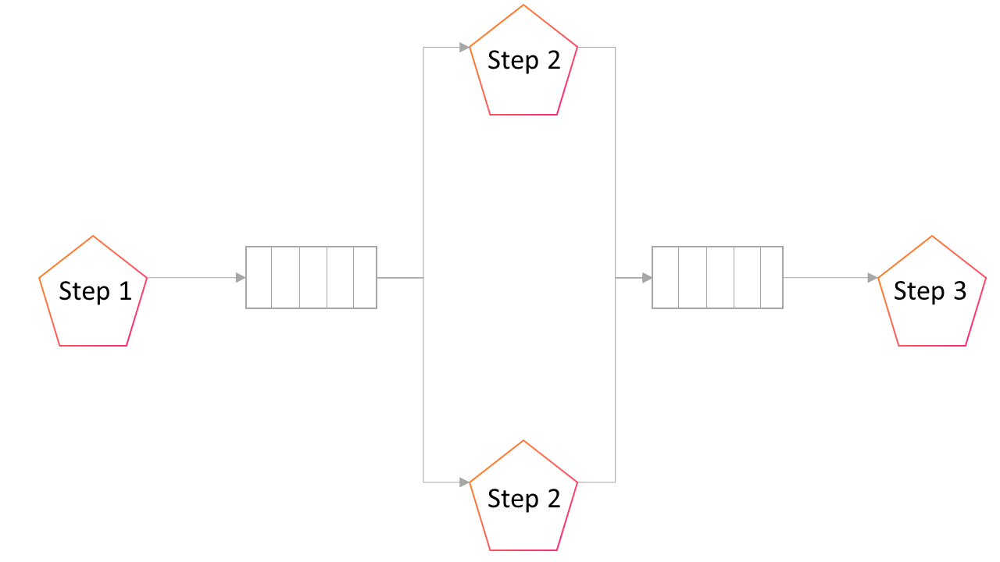

---

**Creator:** Igor (drobiazko), Elastic.io  
**Last revised by:** Philipp (philecs), Cloud Ecosystem  
**Last update:** 04-06-2018

---

# Introduction

The message oriented middleware is a central part of the Open Integration Hub and is needed to store and route messages while transferring them from senders to receivers.

# Description

The documents describes an integration flow and how two steps are connected via a message oriented middleware.

# Technologies used

- RabbitMQ

## Reasoning

RabbitMQ can handle more than 1M messages per second. Additionally to that, Organizations in XPC are not communicating with each other, which gives us a perfect case for horizontal scalability - we deploy multiple RabbitMQ instances to handle load linearly.

# Conceptional Elaborations

An integration flow is represented by a directed acyclic graph in which
nodes are represented by integration components communicating with a
particular API or executing some custom logic. The edges of the
integration graph define which of two components are connected.

An integration flow is executed by number of [Pods](https://kubernetes.io/docs/concepts/workloads/pods/pod/),
each representing a flow's node, also called a `flow step`. The steps
communicate which each other through a messaging queue, such as [RabbitMQ](https://www.rabbitmq.com/).
The following diagram displays an example of an integration flow using
a message broker.

In the diagram above `Step 1` is a trigger component producing data by
polling an API periodically. The produced messages are sent to a queue
connecting `Step 1` and `Step 2`. Because the component in `Step 2` is
very slow, its consumption rate is lower than the publish rate. The
result is that the queue is growing. That's why 2 instances of `Step 2`
are started, each consuming messages from the same queue. The message
broker makes sure that the messages are sent to a single consumer only.
