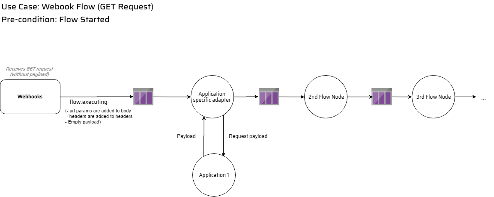
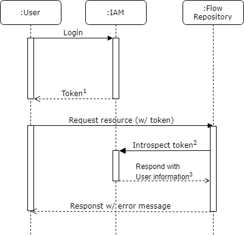

---

**Creator:** Philipp ([philecs](https://github.com/philecs)), Cloud Ecosystem e.V. <br>
**Last revised by:** - <br>
**Last update:** 15-03-2019

---

# Introduction

This document is designed to describe different service collaboration use cases.

Each use case is described through a graphical overview, a textual description and pre-conditions.

- [Introduction](#introduction)
  - [Starting a flow](#starting-a-flow)
    - [Detailed Service Consideration](#detailed-service-consideration)
      - [Flow repository](#flow-repository)
      - [Webhooks](#webhooks)
      - [Scheduler](#scheduler)
  - [Execute Polling Flow](#execute-polling-flow)
  - [Execute Webhook Flow](#execute-webhook-flow)
    - [POST Request](#post-request)
    - [GET Request](#get-request)
    - [Healtcheck Request](#healtcheck-request)
  - [Request Resources](#request-resources)

## Starting a flow

**Pre-Conditions:** None.

This use cases describes the scenario of starting a flow. Once the user starts a flow the following steps are processed:

1. Client starts a flow using flow repository's REST API
2. `Flow Repository` sets the flow's `status` to `starting` and raises the event `flow.starting` 
3. There are 3 services listening to the event `flow.starting`:  Webhooks, Scheduler and Resource Coordinator. `Webhooks` and `Scheduler` examine the event's payload and decide if they need to react appropriately. We will discuss the exact reaction of both services later in this document.
4. Upon receiving `flow.starting` event the `Resource Coordinator` starts deploying the containers. Once all containers were deployed, `Resource Coordinator` raises the `flow.started` event.
5. `Flow Repository` receives the `flow.started` event and switches flow's `status` property from `starting` to `started`.
6. `Webhooks` receives the `flow.started` event and starts receiving incoming HTTP calls for the given flow.
7. `Scheduler` receives the `flow.started` event and starts scheduling the flow, according to it's cron property.
8. When a client stops a running flow using flow repository's REST API, the event `flow.stopping` is raised which is causing an inverse reaction chain of events.


Figure: _startFlow_

### Detailed Service Consideration

Now let's discuss the individual services in details.

#### Flow repository

We need to extend the API by the following resources:

* `POST /flows/{id}/start`: Used to start a flow
* `POST /flows/{id}/stop`: Used to stop a flow

Starting a flow means setting flow's `status` to `active` and raising `flow.starting` event. Stopping a flow means setting flow's `status` to `inactive` and raising `flow.stopping` event. The schema of the event payload is shown below.

```yaml
Event:
  type: object
  required:
    - headers
    - payload
  properties:
    headers:
      type: object
       required:
         - name
         - createdAt
      properties:
        name:
          type: string
        createdAt:
          type: string
          format: date-time
    payload:
      type: object
```

The `payload` property is an arbitrary object to be sent with the event. Flow repository will send the entire flow as `payload`. 

We also need to extend the `flow` model in the API by the following properties:

- `id`: required
- `cron`: required for polling flows and defaults to `*/3 * * * *` if not set for a polling flow. Must not be set for a webhook flow.

#### Webhooks

Upon receiving `flow.starting` event the service checks if the `isWebhook` property is set. If so, the service persist a data record in his local DB but **doesn't start receiving HTTP requests** for the given flow yet. The following table demonstrates an example of such records.

| flowId        | queue           | 
| ------------- |:-------------:|
| 58b41f5da9ee9d0018194bf3      | queue_58b41f5da9ee9d0018194bf3 | 
| 5b62c91afd98ea00112d5404      | queue_5b62c91afd98ea00112d5404      | 

After receiving the `flow.started` event, the service starts accepting incoming messages from the flow's webhook URL and sends them to the corresponding queues to be handled by flow nodes. This is actually how it is accomplished today. The only difference is that webhooks service is retrieving all the required data about a webhook flow from its local DB.

Please note that the webhooks service ignores the event if at least one of the following conditions is met:

- `cron` property is present in the event

Upon receiving the `flow.stopping` event, the service deletes the record for the given flow and stops accepting requests.

#### Scheduler

Upon receiving `flow.starting` event the service checks if the `cron` property is set. If so, the service persist a data record in his local DB, but **doesn't start scheduling** the given flow yet. The following table demonstrates an example of such records.

| flowId        | cron           |  dueExecution |
| ------------- |:-------------:|:-------------:|
| 58b41f5da9ee9d0018194bf3      | */3 * * * * | 2019-01-25T13:39:28.172 |
| 5b62c91afd98ea00112d5404      | 15 14 * * 1-5      |  2019-01-27T14:15:00.00 |

Upon receiving the `flow.started` event the service starts scheduling the flow executions by retrieving the flow data from its local DB.

Please note that the scheduler service ignores the event if at least one of the following conditions is met:

- `cron` property is **not** present in the event

Upon receiving the `flow.stopping` event, the service deletes the record for the given flow and stops scheduling flow executions.

## Execute Polling Flow

**Pre-Conditions:** Starting a flow.

As described in [scheduler section](#scheduler) when a flow is started the service starts scheduling the flow executions. Once the scheduler finds a flow that is ready for execution it pushed a message including the relating flow ID to the queue. The recipient is the first node of the flow which is the application specific adapter. This adapter then makes a GET request to the aplications API to get the payload. Afterwards it pushes the message including the payload onto the queue.

The message format of the messages emitted by scheduler have the following structure:

```js

{
    "id" : //some record uuid,
    "attachments":{
        //empty
    },
    "body": {
        //empty
    },
    "headers": {
        //empty
    },
    "metadata": {
        //empty
    }
}
```


Figure: _executePollingFlow_

## Execute Webhook Flow

### POST Request

**Pre-Conditions:** Starting a flow.

Once Webhooks receives a POST request it pushes the message to the queue. The recipient is the first node of the flow which is the application specific adapter.
In contrast to the GET request, this request already includes the payload.

The following example shows the message format of Webhooks messages:

```js
{
  "headers": {
    //GET request headers
  },
  "query": {
    //POST request query parameters
  },
  "body": {
    //POST request body
  },
  //other properties
}
```


Figure: _executeWebhookFlowPost_

### GET Request

**Pre-Conditions:** Starting a flow.

Once Webhooks receives a GET request it takes the url parameters and request headers and put it into the message. This means in particular the headers go to `headers` while query string parameters go to `body`. It then pushes the message to the queue. The recipient is the first node of the flow which is the application specific adapter. This adapter then makes a GET request to the aplications API to get the payload. Afterwards it pushes the message including the payload onto the queue.

The following example shows the message format of Webhooks messages:

```js
{
  "headers": {
    //GET request headers
  },
  "body": {
    //GET request query string parameters
  },
  //other properties
}
```

An examplary webhook GET request could look like the following: `GET /hook/<flow-id>?param1=value&param2=value`



Figure: _executeWebhookFlowGet_

### Healtcheck Request

Tbd

## Request Resources

Once a user logs in into IAM he receives an ephemeral token which can be used for requesting oih resources. When a user requests a certain resource (e.g. all user related flows) the target service introspects the users' token at IAM. This is done using IAM utils (middleware). The service then receives several user information related to this token. These information can be e.g. username, tenant, role and the permissions the user has. If the user has the permission to request the certain resource the service responds with the requested information (Figur _requestResourceSuccess_). If the user requests a resource without the permission to do so the service will response with an error message (Figur _requestResourceSuccess_).


Figure: _requestResourceSuccess_



Figure: _requestResourceSuccess_

**1**: Ephemeral token<br>
**2**: Service makes request with service account token<br>
**3**: User information e.g.: username, tenant, tenant specific role, permissions