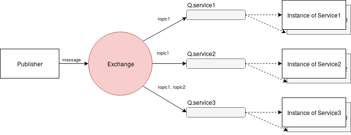

# Architecture

A published event has to be received by several interested services.
There can be running several instances of a service at the same time.
We need to send only to one instance of each service that is interested.

Therefore the following architecture is suggested:

Publisher is the publishing service.

Q. is the Queue. There should be a Queue for each kind of service.
