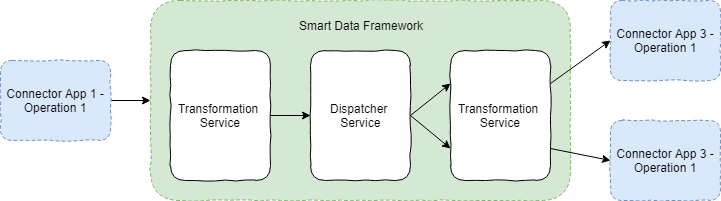

# Dispatcher Service

The dispatcher service is a central component in the hub and spoke service collaboration. 
It is responsible for delivering messages from one application to one or more target applications based on a tenant specific configuration.

## Service
### Entry Point

The service is triggered by messages arriving through a SDF Adapter Component used in a Connector Flow. 

### Tenant specific configuration

Each tenant owns a configuration which specifies his applications and their synchronization behavior.
The configuration contains information about:
* which application is connected to another applications
* full duplex/half duplex connections
* leading system configuration

Tenant specific configuration:

| applicationId | domain | connected to OIH | inbound | outbound |
| ------------- | ------------- | ------------- | ------------- | ------------- |
| crm1 | customer | true | true | true |
| contactmanagement2 | customer | true | true | true |
| cms1 | product | true | false | true |

For each received message, the configuration is evaluated to determin how to process the message. 
Message characteristics relevant for the dispatcher service:
* tenant id
* source domain
* source application
* source operation

After evaluating the tenant specific configuration for a message, the configured target applications are known.

### message processing

If a tenant specified one or more connected application which should receive the message, the original message is posted to each target application. The oihUid of the oihDataRecord will remain the same as in the original message.

## open questions

* client-separation: should there be dispatcher instances for all tenants or should there be instances for each tenant?
* horizontal scaling: how to deal with message sequences
* the service interface will be a queue, how do the messages from the SDF adapter reach this queue

