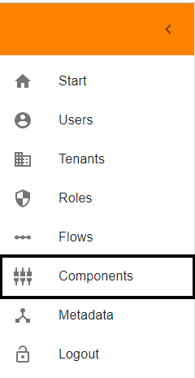
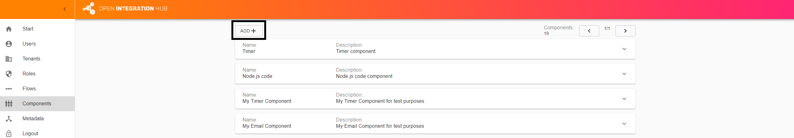
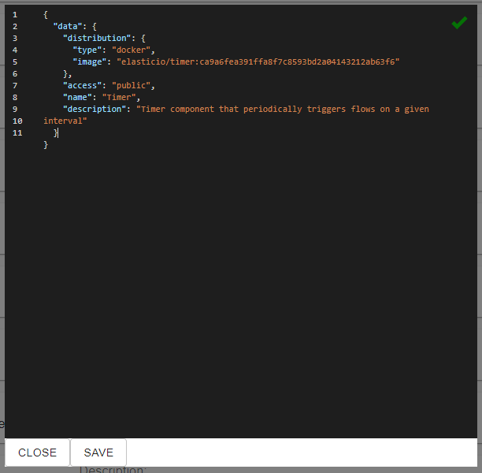
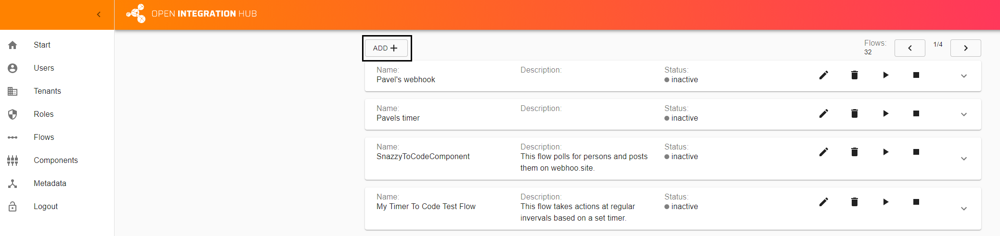
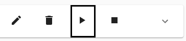
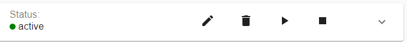

<p align="center">
  
</p>

Open source framework for easy data synchronization between business applications.

Visit the official [Open Integration Hub homepage](https://www.openintegrationhub.de/)

# Local Installation Guide

 

In addition to setting up the Open Integration Hub on a cloud infrastructure such as GCP it is also possible to setup a local version of the framework. Make sure to perform the following to set up a local version of the OIH within your own minikube:

- [Requirements](#requirements)
- [Installation](#installation)
  - [Install Minikube](#install-minikube)
  - [Basic Open Integration Hub Infrastructure Setup](#basic-open-integration-hub-infrastructure-setup)
  - [Host Rules Setup](#host-rules-setup)
  - [Identity and Access Management Deployment](#identity-and-access-management-deployment)
  - [Service Account Creation](#service-account-creation)
    - [Login as Admin](#login-as-admin)
    - [Create a Service Account](#create-a-service-account)
    - [Create persistent Service Token](#create-persistent-service-token)
  - [Shared Secret Application](#shared-secret-application)
  - [Service Deployment](#service-deployment)
  - [Service Availability](#service-availability)
- [Usage](#usage)
  - [Creating Components](#creating-components)
  - [Creating Flows](#creating-flows)
  - [Starting Flows](#starting-flows)
  - [Lessons Learned](#lessons-learned)

# Requirements

**Please make sure to clone the [monorepo](https://github.com/openintegrationhub/openintegrationhub) before you start.**

Make sure that minikube is endowed with sufficient resources. We suggest at least:

- _8GB of memory_
- _4 CPUs_


|If you're using Windows we suggest to use virtual box. In order to use it, Hyper-V must be disabled [Enable/Disable Hyper-V on Windows 10](https://docs.microsoft.com/de-de/virtualization/hyper-v-on-windows/quick-start/enable-hyper-v).You may also have to enable virtualisation features in you BIOS.|
|---|

# Installation

## Install Minikube

Make certain minikube is installed, configured, and started. The command for allocating sufficient resources is

    minikube start --memory 8192 --cpus 4

If you already have an installed minikube instance that is using the virtualbox driver you can do

    minikube stop

and then

    VBoxManage modifyvm "minikube" --memory 8192 --cpus 4

to adjust the resource limits before starting again.

In particular, ensure that its ingress module is enabled (`minikube addons enable ingress`).  Also make certain that `kubectl` is configured to use minikube. To see if its correctly configured use

    `kubectl config current-context
    or
    cluster info`

For further information about how to set up minikube, see here:

- [Install Minikube](https://kubernetes.io/docs/tasks/tools/install-minikube/)
- [Installing Kubernetes with Minikube](https://kubernetes.io/docs/setup/learning-environment/minikube/)


|If you're using Docker for Windows it overwrites the acutal kubectl version. In order to fix this download the `kubectl.exe` from [Install kubectl on Windows](https://kubernetes.io/docs/tasks/tools/install-kubectl/#install-kubectl-on-windows). Navigate to the docker directory (e.g. Program Files\Docker\Docker\resources\bin) andreplace the kubectl.exe in this folder with the one you just downloaded.|
|---|

## Basic Open Integration Hub Infrastructure Setup

**Please make sure to clone the [monorepo](https://github.com/openintegrationhub/openintegrationhub) before you start. You will need the files in the minikube folder.**

Set up the basic Open Integration Hub infrastructure. To do this, simply execute

`kubectl apply -f ./1-Platform`

This may take a while to finish. You can use `minikube dashboard` to check the status of the various deployments. Once they are all ready, you can proceed.

## Host Rules Setup

To actually reach the services, you need to add an entry in your hosts file for each service. You can retrieve the IP with `minikube ip` and need to create an entry for each host listed in the `ingress.yaml` file (e.g. `iam.localoih.com`).
If you are using...

a **Linux** distribution, you can automate this by using this terminal command:

```console
echo "$(minikube ip) iam.localoih.com smk.localoih.com flow-repository.localoih.com auditlog.localoih.com metadata.localoih.com component-repository.localoih.com webhooks.localoih.com attachment-storage-service.localoih.com data-hub.localoih.com ils.localoih.com web-ui.localoih.com" | sudo tee -a /etc/hosts
```

a **Windows** distribution, you can find the host files under:

```console
c:\windows\system32\etc\hosts
or
c:\windows\system32\drivers\etc\hosts

then add

your_minikube_ip iam.localoih.com
your_minikube_ip smk.localoih.com
your_minikube_ip flow-repository.localoih.com
your_minikube_ip auditlog.localoih.com
your_minikube_ip metadata.localoih.com
your_minikube_ip component-repository.localoih.com
your_minikube_ip webhooks.localoih.com
your_minikube_ip attachment-storage-service.localoih.com
your_minikube_ip data-hub.localoih.com
your_minikube_ip ils.localoih.com
your_minikube_ip web-ui.localoih.com
```

## Identity and Access Management Deployment

Deploy the OIH Identity and Access Management. To do so, simply execute `kubectl apply -f ./2-IAM`. Again, wait until the service is fully deployed and ready.

## Service Account Creation

Create a service account and token for the other services in the OIH IAM. Using Postman (or another similar tool of choice), send these POST requests the IAM.

**Base URL:** `iam.localoih.com`

**Header:** `Content-Type: application/json`:

### Login as Admin

 _Path_:

`/login`

_Request Body:_

```json
  {
    "username": "admin@openintegrationhub.com",
    "password": "somestring"
  }
```

_Response Body Structure:_

```json
  {
    "token": "string"
  }
```

Use the returned `token` as a Bearer token for the remaining requests.

### Create a Service Account

_Path:_

`/api/v1/users`

_Request Body:_

  ```json
  {
    "username":"test@test.de",
    "firstname":"a",
    "lastname":"b",
    "role":"SERVICE_ACCOUNT",
    "status":"ACTIVE",
    "password":"asd",
    "permissions":[
      "iam.tokens.introspect",
      "iam.token.introspect",
      "components.get"
    ]
  }
  ```

 _Response Body Structure:_

```json
{
  "id": "string",
  "username": "string",
  "firstname": "string",
  "lastname": "string",
  "status": "active",
  "tenant": "string",
  "roles": [
    {
      "name": "string",
      "permissions": [
        "all"
      ],
      "scope": "string"
    }
  ],
  "permissions": [
    "all"
  ],
  "confirmed": true,
  "img": "string"
}
```

Use the returned `id` in the following request to create the token.

### Create persistent Service Token

_Path:_

`/api/v1/tokens`

_Request Body:_

```json
{
  "accountId": "{PASTE SERVICE ACCOUNT ID HERE}",
  "expiresIn": -1,
  "initiator": "{PASTE SERVICE ACCOUNT ID HERE}",
  "inquirer": "{PASTE SERVICE ACCOUNT ID HERE}"
}
```

The returned token is the service token that will be used by the other services to authenticate themselves to the IAM. Copy the value, encode it in *base64* (for encoding you can use online tools such as: <https://www.base64encode.org/>), and then past it into the file found at `./3-Secret/SharedSecret.yaml` at the indicated position (`REPLACE ME`).

## Shared Secret Application

Apply the shared secret via

    kubectl apply -f ./3-Secret.

Ordinarily, each service would have its own secret for security reasons, but this is simplified for ease of use in a local context

## Service Deployment

Deploy the remaining services via the following command. This may take a while.

    kubectl apply -Rf ./4-Services

## Service Availability

The Open Integration Hub is now running and ought to function just as it would in an online context. You can reach the various services via the following URLS:

- **Identity and Access Management**. Create and modify users, tenants, roles, and permissions.
  - `iam.localoih.com`
- **Secret Service**. Securely store authentication data for other applications.
  - `skm.localoih.com`
- **Flow Repository**. Create, modify, and start/stop integration flows.
  - `flow-repository.localoih.com`
- **Audit Log**. View event logs spawned by the other services.
  - `auditlog.localoih.com`
- **Metadata Repository**. Create and modify master data models used by your connectors.
  - `metadata.localoih.com`
- **Component Repository**. Store and modify connector components.
  - `component-repository.localoih.com`
- **Attachment Storage Service**. Temporarily store larger files for easier handling in flows.
  - `attachment-storage-service.localoih.com`
- **Data Hub**. Long-term storage for flow content.
  - `data-hub.localoih.com`
- **Integration Layer Service**. Perform data operations such as merging or splitting objects.
  - `ils.localoih.com`
- **Web UI**. A basic browser-based UI to control certain other services.
  - `web-ui.localoih.com`

Most of these services have an OpenAPI documentation of their API available through the path `/api-docs`. You can also check the [API Reference Documentation](https://openintegrationhub.github.io/docs/API%20Reference/APIReferenceOverview.html). If you want to learn more about the services, check the [Service Documentation](https://openintegrationhub.github.io/docs/Services/Services.html) or their readmes in the `services` folder of the GitHub Repository: [Open Integration Hub Services](https://github.com/openintegrationhub/openintegrationhub/tree/master/services)

# User Tutorial

The following step-by-step guide will show you how you can add your first components and create a flow with these components via the provided web ui. All actions are also performable via postman or similar tools.

## Creating Components

First, we have to create two components in order to have a source and target component.

Below you will find code snippets for two exemplary components. For the beginning we recommend to use those but feel free to use your own.

**Example 1:**

```json
{
   "data":{
      "distribution":{
         "type":"docker",
         "image":"elasticio/timer:ca9a6fea391ffa8f7c8593bd2a04143212ab63f6"
      },
      "access":"public",
      "name":"Timer",
      "description":"Timer component that periodically triggers flows on a given interval"
   }
}
```

**Example 2:**

```json
{
    "data": {
        "distribution": {
            "type": "docker",
            "image": "elasticio/code-component:7bc2535df2f8a35c3653455e5becc701b010d681"
        },
        "access": "public",
        "name": "Node.js code",
        "description": "Node.js code component that executes the provided code"
}
```

The timer component is used to trigger flows on a provided interval, while the code component executes the code that was provided by the flow creator.

In order to add those components, visit the web ui (`web-ui.localoih.com`) and navigate to the `Components` section.

<p align="left">
  
</p>

Now click on the `ADD+` button. A popup window will appear where you can add the code provided above.

<p align="left">
  
</p>

<p align="left">
  
</p>

**GREAT!** You created your first component.

Repeat this step for the second component.

**!!** In order to create the flow in the next step you have to copy the `ids` of the components you just created. **!!**

## Creating Flows

Now that you successfully created two components it is time to create your first flow.

Below you will find code snippets for an example flow. This excample flow periodically triggers the flow and sends request to webhook.site. For the beginning we recommend to use this flow but feel free to create your own.

Please replace the `ADD COMPONENT ID HERE` with the `ids` you copied in the previous step. Furthermore please go to http://webhook.site/ and copy the link to you clipboard.
Afterwards please replace the `ADD WEBHOOK URL HERE` with the link in your clipboard.

```json
{
   "name":"Timer To Code Component Example",
   "description:": "This flow periodically triggers the flow and sends request to webhook.site",
   "graph":{
      "nodes":[
         {
            "id":"step_1",
            "componentId":"ADD COMPONENT ID HERE",
            "function":"timer"
         },
         {
            "id":"step_2",
            "componentId":"ADD COMPONENT ID HERE",
            "function":"execute",
            "fields":{
               "code":"function* run() {console.log('Calling external URL');yield request.post({uri: 'ADD WEBHOOK URL HERE', body: msg, json: true});}"
            }
         }
      ],
      "edges":[
         {
            "source":"step_1",
            "target":"step_2"
         }
      ]
   },
   "cron":"*/2 * * * *"
}
```

In order to add the flow, navigate to the `Flows` section.

<p align="left">
  
</p>

Now click on the `ADD+` button. A popup window will appear where you can add the code provided above.

<p align="left">
  
</p>

<p align="left">
  
</p>

**GREAT!** You created your first flow.

## Starting Flows

Now that you have created two components and a flow, it is time to start this flow.

Stay in the flows section and look for the flow you just created. On the right side you will the a "play" symbol.

<p align="left">
  
</p>

Click on it and the how the status changes from `inactive` to `starting`.

<p align="left">
  
</p>

<p align="left">
  
</p>

After some time the status changes to `active` and the flow is running (you may have to refresh the site).

<p align="left">
  
</p>

## Lessons Learned

In this tutorial you have learned...

1. How to create components via the web ui
2. How to create a flow within the Open Integration Hub using existing components
3. How to start a flow and track its status
