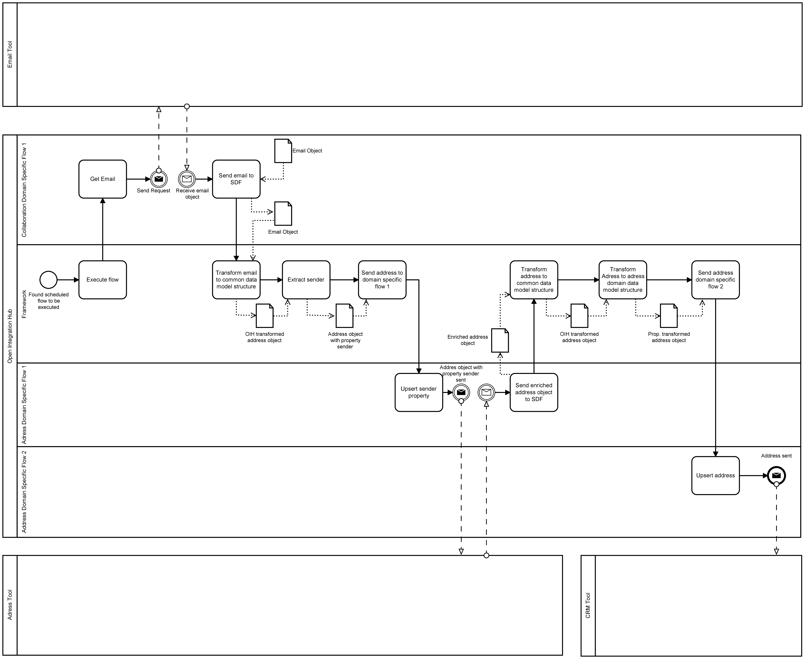

# Status

proposed

# Context

As we have to prioritize we need to decide wether we want to implement a proper hub and spoke model now or postpone it.
Therefore we describe two alternatives here (hub and spoke vs. flow definition). The decision indicates wether the hub and spoke implementation is postponed (alternative: peer-To-peer) or not (alternative: hub and spoke).

# Alternatives

## Hub And Spoke

Hub and spoke definition: "Hub-and-Spoke is a MOM that uses a **central message broker**. The communication is not made between pairs of applications, but **between each application (spoke) and the central hub**. The broker functionalities include **routing** and **messages transformation** to the receiver spoke. This architecture allows **content based routing**, which performs based on information in the message header or in some element defined in the message body. The hub can apply rules to the content of the message and determine the receiver spokes." _-_ [_polarising.com_](https://www.polarising.com/2016/09/hub-spoke-architecture/)

In the context of OIH this means that an integration flow from one application to another is split into 2 flows. The first flow has the source applications as its source while the target is the Open Integration Hub. The second flow has the Open Integration Hub as its source while the target is the target application. This architecture is illustrated in figure 1. The red arrows exemplary show how 2 peer-to-peer flows would be splitted up into 3 flows. (Application 1 to OIH, OIH to Application 5 and OIH to Application 3).

Figure 1 illustrates this definition:

In addition to simple data synchronization, the hub and spoke model also provides mechanisms so that process/flow templates can easily be used. Through the solution independent design process templates can easily be reused. The BPMN below shows an exemplary use case and how this use case can be resolved by using a hub and spoke model:

1. New E-Mail in inbox
2. OIH-Inbox-Component grabs address (sender)
3. OIH-Inbox-Component propagates grabbed address to OIH
4. Adress is sent to the Address-Tool which takes this address for its repository
5. Address-Tool enriches this address with further contact details
6. Address-Tool pushes enriched address back to the OIH (Steps 5-6 can be managed in different ways. Depends on the response by the API e.g. if an enriched object is returned when making a POST request)
7. Enriched address is sent to CRM-System which stores this enriched address

### Decision

The decision is that the Open Integration Hub supports both alternatives. The Hub and Spoke as well as the peer-to-peer model work with flows stored within the flow repository. It depends on the way the flows are model which model is applied. To implement the hub and spoke model there would be e.g. one central application independent flow which only mentions the domain but not a specific application within this domain. Depending on the tenant specific configuration, different spoked (applications) are targeted. Nevertheless, to implement the hub and spoke model several parts must be planned and developed in the near future. These missing parts e.g. include a dispatcher service and a domain specific smart data framework adapter.

### Consequences

* A dispatcher service must be implented which stores routing information. This services knows which application subscribed to which events and therefore knows to which application certain messages must be forwarded to.
  * The incoming message must then be forwarded to certain message queues (Question: who forwards this message? dispatcher service itself or does it only inform another service which applications has to be served?)
* Bidirectional communication is easier to implement: A new application only requires a single connections to the Open Integration Hub instead of an exponential number of connections compared to peer-to-peer.
* Central conflict management is enabled?
* A common data model is required. All connected applications use transformer components which transforms between the application specific data model and the common data model
* Application specific Ids must be resolved in order to enable application overwhelming ID linking
  * E.g.: Same data record exists in multiple applications --> OIH must centrally manage these IDs in order to correclty synchronize these data records

## Peer-To-Peer

Peer to peer definition: "With a point-to-point architecture, systems talk directly to one another. That means the complexity and cost of creating a fully integrated platform increase exponentially as you add new systems. Two systems require one connection. Four require six. Eight require twenty-eight. While initially simpler, the costs significantly outweigh the benefits as your business grows." _-_ [_nchannel.com_](https://www.nchannel.com/blog/4-business-benefits-hub-spoke-integration-architecture/)

In the context of OIH this means that to implement a bidirectional integration between three different a total of 6 flows are required for full duplex communication (1 flow if a leading system is defined and the connection is oneway). These flows can either be realized by single flows or by "branched" flows. Branched flows means that we define a flow with one source but explicilty define a set of targets as shown in the figure below.

### Decision

The decision is that the Open Integration Hub supports both alternatives The Hub and Spoke as well as the peer-to-peer model work with flows stored within the flow repository. It depends on the way the flows are model which model is applied. To implement the peer-to-peer model it is sufficient to explicitly mention the source and target(s) instead of only using generic domain information.

### Consequences

* Bad scalability: Each new application requires exponential number of flow changes
* Fast and easy peer-to-peer integration
* Each integration must be explicitly modelled from end-to-end
* Integration patterns must be applied on each flow. E.g. Integration patterns that have been used in a flow from application 1 to 2 must be configured in an integration from application 3 to application 2.
* Using a common data model is optional

#### Questions

* What happens if a data record changes within two systems? How can conflict management be realized?
* Is there still the need for a central linkage of IDs or is it done flow specific within the connectors?

