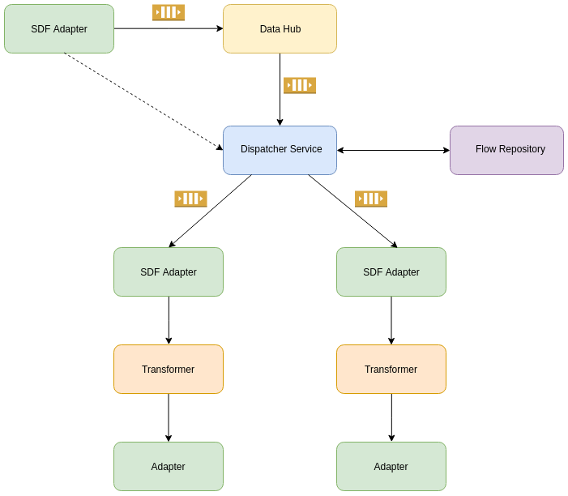

<p align="center">
  
</p>

The revolution in data synchronization — the Open Integration Hub enables simple data synchronization between any software applications and thus accelerates digitalisation

Visit the official [Open Integration Hub homepage](https://www.openintegrationhub.de/)

# Dispatcher Service
The OIH Dispatcher Service can be used to transfer data from one flow to another. This allows for automated propagation of data among any number of connected applications and serves as the basis for the OIH Hub and Spoke functionality.

## Technical description
The Dispatcher service consists of two main parts: A user-facing API that allows for the creation and modification of tenant-specific hub-and-spoke configurations, and an automated component that propagates data based on these configurations.

### Configuration

A configuration describes a list of sources by their application ID and Domain, and links each source with a set of receiving flows that are intended to receive data from it. For example:

```json
{
  "tenant": "Example Tenant",
  "connections": [
    {
      "source": {
        "appId": "Wice",
        "flowId": "xyz",
        "domain": "Addresses",
      },
      "targets": [
        {
          "active": true,
          "appId": "Snazzy",
          "flowId": "abcd",
        },
        {
          "active": true,
          "appId": "Outlook",
          "flowId": "defg",
        },
      ],
    },
    {
      "source": {
        "appId": "Snazzy",
        "flowId": "uvw",
        "domain": "Addresses",
      },
      "targets": [
        {
          "active": true,
          "appId": "Wice",
          "flowId": "hijk",
        },
        {
          "active": true,
          "appId": "Outlook",
          "flowId": "defg",
        },
      ],
    },
  ],
}
```

In this example, any changes made in Wice are propagated to Snazzy and Outlook, and changes made in Snazzy are propagated to Wice and Outlook. Changes made in Outlook are not propagated, as it is not listed as a source.

Each target has a specific flow associated with it, which must be created ahead of time. These flows must have the SDF Adapter as a source node, to be able to receive data from the Dispatcher service.

### Propagation

The Dispatcher Service listens for data update events published by the Data Hub. Whenever such an event is received, it checks whether the associated tenant has a configuration listing the source and domain of the change as a source.

If this is the case, the Dispatcher Service then iterates through all listed active targets for this source/domain. The Flow Repository is checked to ascertain whether the flows exist and are currently active. Any inactive flows are (re-)started by the Dispatcher Service. Then the update data is propagated to each of the flows' SDF adapters.



## Local installation/development

## REST-API documentation

Visit `dispatcher-service.openintegrationhub.com/api-docs/` to view the Swagger API-Documentation

## Current status
Dispatcher service is currently capable of:
- Storing and retrieving dispatch configurations
- Routing incoming dispatch events according to these configurations
- Communicating with the Flow Repository to check the flows statuses, and start them if necessary

Currently outstanding issues:
- Validation of dispatch configurations
- Validation of incoming dispatch events
- Analysing potential security concerns when viewing flows and routing messages
